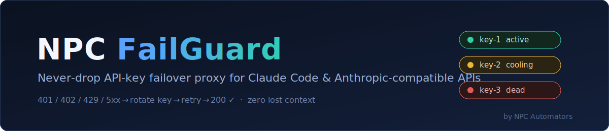
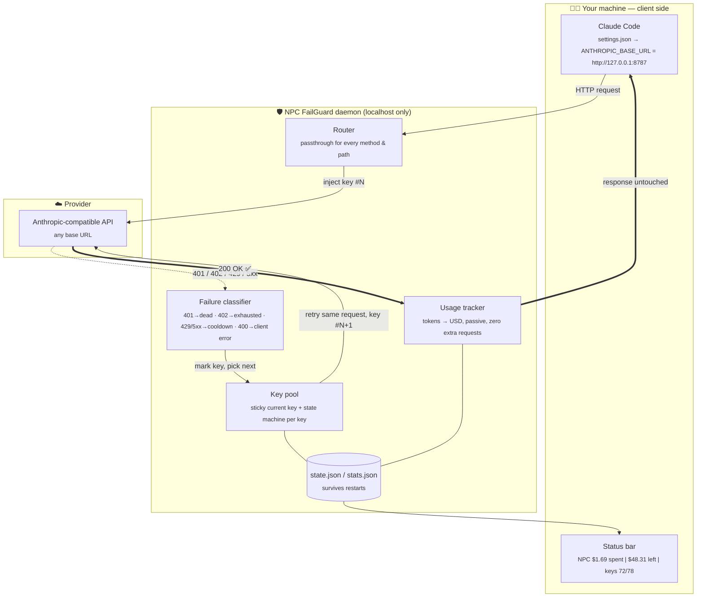
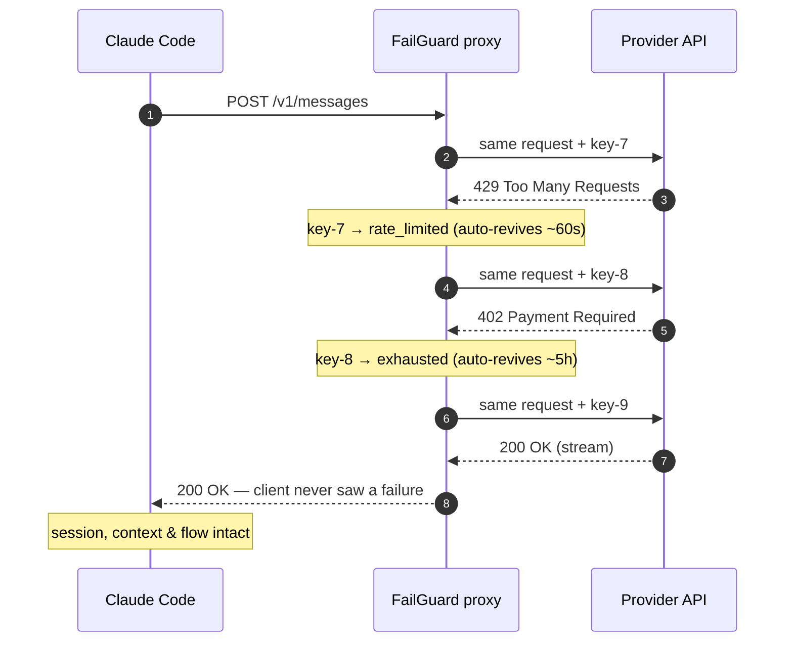

<div align="center">



# NPC FailGuard

**Never-drop API-key failover for Claude Code & Anthropic-compatible APIs.**

[](https://github.com/NPCAutomators/NPC-FAILGUARD-V1/actions/workflows/windows.yml)
[](https://github.com/NPCAutomators/NPC-FAILGUARD-V1/actions/workflows/linux.yml)


*One key dies → the next takes over, mid-request. No restart, no lost context, no interruption.*

[Quick start](#-quick-start) •
[Architecture](#-architecture--the-full-process) •
[Why I built this](#-why-i-built-this) •
[What you get](#-what-it-gives-you) •
[For students](#-why-students-should-use-it) •
[Install](#-install-on-linux) •
[Usage](#-how-to-use)

</div>

---

## ⚡ Quick start

**Linux**
```bash
curl -fsSL https://raw.githubusercontent.com/NPCAutomators/NPC-FAILGUARD-V1/main/bootstrap.sh | bash
```

**Windows (PowerShell)**
```powershell
irm https://raw.githubusercontent.com/NPCAutomators/NPC-FAILGUARD-V1/main/bootstrap.ps1 | iex
```

Then open a **new** terminal, run `claude`, and add your provider + keys:
```
/npc-failguard:setup <base-url> <key1 key2 ... or /path/to/keys.txt>
```
Every argument is optional — run `/npc-failguard:setup` with nothing to see setup
state and next steps, give only the URL now and add keys later (or the other way
round). Verify anything anytime with `/npc-failguard:status` — free, zero credit.

That's it — Claude Code now routes through the proxy, keys rotate automatically, and
the status bar shows live spend.

---

## 🎯 What it does — in one paragraph

NPC FailGuard is a **local reverse proxy** that sits between Claude Code (or any
Anthropic-compatible client) and your API provider, and transparently manages a
**pool of API keys**. When the current key fails — invalid (`401`), out of credit
(`402`), rate-limited (`429`), or the provider itself hiccups (`5xx`) — the proxy
classifies the failure, marks the key accordingly, and **silently replays the exact
same request with the next healthy key**. The client never sees the failure; it just
receives a slightly delayed `200`. Your coding session, your context window, and
your train of thought all survive intact.

**© 2026 NPC Automators. Proprietary — personal use only. See [LICENSE](LICENSE).**
Bring your own API keys. You are responsible for complying with your provider's terms.

---

## 🏗 Architecture — the full process

Everything runs on your machine. The proxy binds to `127.0.0.1:8787` only — no key,
request, or statistic ever leaves your computer except the API call itself.



And the moment-by-moment story of one failover — what happens in the ~2 seconds
where other setups would crash your session:



The daemon runs in the background — via **systemd** (user service, no root) on Linux,
via a **hidden autostart entry** (per-user Run key, no admin rights, no console
window) on Windows — and survives logout/reboot.

### The key state machine

Each key lives in exactly one state. Every transition is automatic — **no state ever
needs a manual reset to recover**:

| State | Trigger | Meaning | Auto-recovers |
|-------|---------|---------|---------------|
| 🟢 `active` | — | usable now | — |
| 🟡 `rate_limited` | `429`, transient `5xx`, provider "busy" | throttled, not broken | ~30–60 s |
| 🟠 `exhausted` | `402` | credit/limit hit | ~5 h |
| 🔴 `dead` | `401`/`403` "invalid token" | genuinely bad key | safety retry after 6 h |

Two safety properties worth noting:

- **Bounded rotation** — one request rotates through at most 10 keys before returning
  a clear `503`, so a single malformed request can never burn the whole pool.
- **Correct blame** — a `400` (your request was malformed) is passed straight back
  and **no key is punished**; a `401` whose body says "busy" or "overloaded" is
  treated as throttling, not death. Misclassification is what kills key pools in
  naive round-robin scripts; the classifier here was built from real provider
  behavior and is pinned down by the test matrix.

---

## 💡 Why I built this

Aggregated / discounted API providers are how many of us can afford to use frontier
models at all — but they come with a brutal failure mode: **keys die mid-session**.
A key runs out of credit at 2 a.m., the provider throttles you during a burst, or a
token silently gets revoked — and Claude Code greets you with `API Error` in the
middle of a refactor. You lose the request, sometimes the context, always the flow.

The obvious workarounds all fail the same test:

- *Manually swapping keys* means editing settings and restarting — your session and
  its carefully built context are gone.
- *Shell scripts that round-robin keys* don't understand **why** a request failed —
  they retry `400`s forever, kill healthy keys over one throttle, and have no memory
  across restarts.
- *Paying for one big key* defeats the entire point of using affordable pools.

So I built the missing piece properly: a small, transparent, well-tested daemon that
treats key failure as a **normal, recoverable event** instead of an emergency. It
took real engineering to get right — failure classification tuned against real
provider responses, SSE streaming passthrough, sticky key selection so prompt caches
stay warm, hot-reload so adding a key never drops your live connection, and state
that survives reboots. All of it is verified by a **287-check end-to-end matrix**
(143 Linux + 144 Windows) that runs a *real installer → real daemon → real
requests → real uninstall* on every push, against a mock provider so testing costs
zero credit.

---

## 🎁 What it gives you

| | Feature | What it means for you |
|--|---------|----------------------|
| 🔁 | **Automatic failover** | Dead / throttled / exhausted keys are skipped in-flight and self-revive. You stop thinking about keys entirely. |
| 🧠 | **Zero-touch install** | One command installs the proxy, auto-installs Claude Code if missing, skips onboarding, registers the plugin, wires `settings.json`. |
| 💸 | **Live cost tracking** | Passive token→USD counter (reads the `usage` block already in each response — zero extra requests) + budget countdown in the Claude Code status bar. |
| 🧰 | **In-session management** | 16 slash commands — add/remove keys, switch providers, check status — all **without leaving Claude Code**, all hot-reloaded, almost all zero-credit. |
| 🖥️ | **Cross-platform** | Linux (systemd user service) and Windows 10/11 (hidden daemon, no admin rights). Same behavior, proven by the same CI matrix on both. |
| 🔒 | **Local-only by design** | Binds to `127.0.0.1`. Keys live in one `chmod 600` file on your disk. Logs and status displays always mask keys to their last 6 characters. |
| 🩺 | **Self-healing + honest errors** | Every failure state auto-recovers, and when nothing can be done you get a *plain-English* `503` ("all keys cooling down — try in ~60s"), never a stack trace. |

---

## 🎓 Why students should use it

Because students are exactly the users this problem hurts most:

1. **You run on free tiers and cheap pools.** Small-credit keys exhaust *constantly*.
   FailGuard turns ten fragile $5 keys into one key that effectively never dies —
   the pool's total credit becomes one smooth resource.
2. **Your study sessions are long; your keys are not.** A key dying 40 minutes into
   debugging an assignment used to mean lost context and a restart. Now it means a
   log line you'll read later — the answer still arrives.
3. **You need to know exactly what you're spending.** The status bar shows live
   spend against the budget *you* set (`/npc-failguard:set-budget 10`), computed
   from exact token counts. No surprise empty balance the night before a deadline.
4. **It's a working systems-engineering case study.** Reverse proxying, streaming
   passthrough, failure taxonomy, state machines, hot-reload, systemd units, hidden
   Windows services, CI matrices across two OSes — the codebase is small enough to
   read in an afternoon (`core/` is ~5 plain-Python files) and real enough to learn
   from. Show *your* professor how failover works — with a live demo.
5. **Zero-credit operations.** Setup, status, key management, log inspection — every
   routine command is engineered to cost **nothing**. The only calls that touch the
   provider are your actual work and the optional `/npc-failguard:health` probe.

---

<details>
<summary><b>📚 Table of contents</b></summary>

1. [Requirements](#-requirements)
2. [Install on Linux](#-install-on-linux)
3. [Install on Windows](#-install-on-windows)
4. [Install as a Claude Code plugin](#-install-as-a-claude-code-plugin)
5. [How to use](#-how-to-use)
6. [Credit / cost tracking](#-credit--cost-tracking)
7. [Switching providers](#-switching-providers)
8. [Testing & quality](#-testing--quality)
9. [Troubleshooting](#-troubleshooting)
10. [Uninstall](#-uninstall)
11. [Repository layout](#-repository-layout)
12. [Limitations](#-limitations)

</details>

---

## 📋 Requirements

- **Linux** with systemd (Ubuntu / Debian / Zorin / Mint / Fedora / Arch / openSUSE),
  **or Windows 10/11** (PowerShell)
- **Python 3.10+** (installed automatically by `uv` if missing)
- `curl`, `ca-certificates` (Linux)
- A plain-text file of your API keys (one key per line)
- A provider base URL (e.g. `https://api.example.com`)

On Linux, `requirements.sh` installs the system packages for you (asks for `sudo` once).

---

## 🐧 Install on Linux

### One-command install (recommended)

```bash
curl -fsSL https://raw.githubusercontent.com/NPCAutomators/NPC-FAILGUARD-V1/main/bootstrap.sh | bash
```

Installs the proxy + Claude Code setup (if missing), **without** API keys.
Then open a **new** terminal, run `claude`, and:

```
/npc-failguard:setup <base-url> <key1 key2 ... or /path/to/keys.txt>
```

Re-running the same command later **upgrades in place** — keys, state, and budget
are preserved automatically.

(Forked or renamed the repo? Set `NPC_FAILGUARD_GITHUB_REPO=<org>/<repo>` before
running, or edit `GITHUB_REPO=` at the top of `bootstrap.sh`.)

Offline / local test:

```bash
NPC_FAILGUARD_TARBALL=file:///path/to/npc-failguard.tar.gz bash bootstrap.sh
```

### Manual install

Three commands, in order, from inside this folder. Every installer shows any error it
hits and ends with **"Press any key to close"** — the terminal never slams shut on you.

**Step 0 — system requirements** (first time on a machine only)
```bash
./requirements.sh
```
Installs `python3`, `pip`, `curl`, `ca-certificates`, `systemd`; enables user
"lingering" so the daemon keeps running after logout. Needs `sudo` (asks once).
At the end it offers to run `install.sh` for you.

**Step 1 — install NPC FailGuard** (no sudo)
```bash
./install.sh
```
Creates a Python venv (3.10+), installs dependencies, sets up the systemd background
service, and **auto-installs Claude Code if it's missing** (official installer), then
configures `~/.claude/settings.json` to route Claude Code through the proxy:
```json
"env": {
  "ANTHROPIC_BASE_URL": "http://127.0.0.1:8787",
  "ANTHROPIC_API_KEY": "npc-failguard-proxy-ignores-this"
}
```
(`settings.json` is the primary mechanism; a matching `~/.bashrc`/`~/.zshrc` block is
also added as a belt-and-suspenders extra. Skip the Claude Code step with
`./install.sh --no-claude`.)

**Step 2 — add your keys + provider**
```bash
./api-setup.sh                                    # interactive
./api-setup.sh --keys-file keys.txt --base-url https://api.example.com --yes   # non-interactive
```
It writes the config, restarts the daemon, and runs a health check (the health check
sends one tiny real request, so it uses a small amount of provider credit).

**Done.** Open a **new terminal** and run `claude`.

---

## 🪟 Install on Windows

### One-command install (recommended)

From PowerShell:

```powershell
irm https://raw.githubusercontent.com/NPCAutomators/NPC-FAILGUARD-V1/main/bootstrap.ps1 | iex
```

Installs the proxy + Claude Code setup (if missing), **without** API keys.
Then open a **new** terminal, run `claude`, and:

```
/npc-failguard:setup <base-url> <key1 key2 ... or C:\path\keys.txt>
```

### Manual install

From PowerShell, inside this folder:

**Step 1 — install**
```powershell
powershell -ExecutionPolicy Bypass -File install.ps1
```
Installs `uv` if missing, creates the venv (downloads Python 3.10+ automatically if the
machine doesn't have it), installs dependencies, registers a **hidden autostart entry**
(per-user Run key — no admin rights needed, no console window to accidentally close),
starts the daemon, auto-installs Claude Code if missing (`irm https://claude.ai/install.ps1 | iex`,
winget fallback), and configures `%USERPROFILE%\.claude\settings.json` the same way as
Linux — proxy routing, the status-bar credit indicator, plugin registration, and
onboarding skip. Skip the Claude Code step with `-NoClaude`.

**Step 2 — add your keys + provider**
```powershell
powershell -ExecutionPolicy Bypass -File api-setup.ps1                                          # interactive
powershell -ExecutionPolicy Bypass -File api-setup.ps1 -KeysFile keys.txt -BaseUrl https://api.example.com -Yes
```

Both scripts show errors and end with "Press Enter to close" — never an abrupt window
close. Logs live in `core\logs\proxy.log` (there is no journalctl on Windows).

---

## 🧩 Install as a Claude Code plugin

The plugin adds slash commands + an operator skill so you can manage the proxy from
inside Claude Code. The daemon must already be installed (steps above).

```bash
claude plugin marketplace add "/path/to/NPC FailGuard"
claude plugin install npc-failguard@npc-failguard-local
```
(Use the folder you cloned/downloaded this repo into; the one-command installer
registers the plugin for you automatically.) Restart Claude Code (or start a new
session), then check:
```bash
claude plugin list          # should show: npc-failguard@npc-failguard-local  ✔ enabled
```

At the start of every session the plugin prints a one-line key-status summary.

---

## 🕹 How to use

### Everyday use
Just run `claude` — `settings.json` routes it through the proxy automatically. Key
rotation happens invisibly.

### Slash commands (inside Claude Code, needs the plugin)

All of these work entirely from inside Claude Code — no separate terminal needed.
Commands marked **free** never touch the provider (no credit used).

| Command | What it does | Cost |
|---------|--------------|------|
| `/npc-failguard:status` | Key states — active / rate-limited / exhausted / dead, current key | free |
| `/npc-failguard:logs` | Recent rotation / error / latency log lines | free |
| `/npc-failguard:add-key <key>` | Add ONE key to the pool (hot-reload, no restart) | free |
| `/npc-failguard:add-keys-txt <path>` | Append all keys from a txt file into the default `api.txt` | free |
| `/npc-failguard:remove-key <label\|last6>` | Remove one key (e.g. `key-7` or its last 6 chars) | free |
| `/npc-failguard:replace-txt <path>` | REPLACE the whole pool from a txt file (state wiped) | free |
| `/npc-failguard:set-base-url <url>` | Switch the upstream provider URL | free |
| `/npc-failguard:usage` | Spend report — $ and tokens per model since last reset | free |
| `/npc-failguard:set-budget <usd>` | Set your total credit; statusline then shows `$ left` (`0` clears) | free |
| `/npc-failguard:reset-usage` | Zero the usage counters (budget kept) — after a credit top-up | free |
| `/npc-failguard:restart` | Restart the daemon | free |
| `/npc-failguard:reset` | Revive ALL keys (clears runtime state, hot-reload) | free |
| `/npc-failguard:health` | Send one tiny test message end-to-end through the proxy | small credit |
| `/npc-failguard:setup` | Guided setup / provider switch — URL and/or keys, **all arguments optional**; no args = show state + next steps | free |
| `/npc-failguard:uninstall` | Guided removal (asks for confirmation first) | free |

Key changes use the daemon's **hot-reload** endpoint instead of a restart, so Claude
Code's own connection through the proxy is never interrupted.

There is also a **`manage` skill** that Claude uses automatically to diagnose proxy
problems (503s, slow responses, all-keys-dead, provider switches).

### From the terminal (no plugin needed)
```bash
# Key statuses (works on both OSes)
curl -s http://127.0.0.1:8787/_npc-failguard/status | python3 -m json.tool

# Is the daemon alive? (platform-aware)
bash scripts/service.sh is-active

# Logs (cross-platform file log; journalctl also works on Linux)
tail -f core/logs/proxy.log
journalctl --user -u npc-failguard.service -f

# Restart / stop (platform-aware)
bash scripts/service.sh restart
bash scripts/service.sh stop

# Key management (same engine the slash commands use)
core/.venv/bin/python core/manage.py status
core/.venv/bin/python core/manage.py add-key <key>
core/.venv/bin/python core/manage.py import-txt <path>
core/.venv/bin/python core/manage.py replace-txt <path>
core/.venv/bin/python core/manage.py remove-key <label|last6>
core/.venv/bin/python core/manage.py set-base-url <url>
# (Windows: core\.venv\Scripts\python.exe core\manage.py ...)

# One-shot test message through the proxy (uses a little credit)
curl -s -H "content-type: application/json" \
  -d '{"model":"claude-haiku-4-5-20251001","max_tokens":30,"messages":[{"role":"user","content":"say hi"}]}' \
  http://127.0.0.1:8787/v1/messages | python3 -m json.tool
```

### Keys file format
Plain text, one key per line. Blank lines and `#` comments are ignored. A line-numbered
format (e.g. `1  your-api-key-...`) is also tolerated.
```
your-api-key-abc123...
your-api-key-def456...
# this is a comment
your-api-key-ghi789...
```

---

## 💰 Credit / cost tracking

The proxy counts every token that passes through it — **passively**. It reads the
`usage` block the provider already includes in each response (both buffered JSON and
streaming SSE), so tracking costs **zero extra credit and zero extra requests**.

- **Spend** is computed from exact token counts (input / output / cache-write /
  cache-read, per model) times the rates in `core/pricing.json`.
- **Remaining credit**: providers don't expose a balance API, so tell the proxy your
  total credit once — `/npc-failguard:set-budget 50` — and it shows
  `budget − spent` from then on. Pass `0` to clear the budget.
- **Status bar**: the installer registers a `statusLine` in `~/.claude/settings.json`,
  so Claude Code's bottom bar shows a live line next to the context indicator:

  ```
  NPC $1.69 spent | $48.31 left (3% used) | keys 72/78 | Fable 5
  ```

  (Restart Claude Code once after installing to see it. If the daemon is down it
  shows `NPC proxy down` instead.)

- `/npc-failguard:usage` prints the full per-model report (requests, tokens, $).
- `/npc-failguard:reset-usage` — or `manage.py reset-usage` — zeroes the counters
  (e.g. after topping up credit); the budget is kept.
- `core/pricing.json` is editable — per-million-token USD rates as
  `[input, output, cache_write, cache_read]`, matched by longest model-id prefix
  (`claude-fable`, `claude-opus`, `claude-sonnet`, …, `default`). Edit it if your
  provider bills differently; it's re-read on every report, no restart needed.
- Counts persist in `core/stats.json` across daemon restarts.

---

## 🔄 Switching providers

Inside Claude Code:
```
/npc-failguard:replace-txt /path/to/new-keys.txt
/npc-failguard:set-base-url https://api.newprovider.com
```
Or from the terminal (old keys and state are wiped):
```bash
./api-setup.sh --keys-file /path/to/new-keys.txt --base-url https://api.newprovider.com --yes
```

---

## ✅ Testing & quality

This project is tested the way infrastructure should be — **end to end, on real
operating systems, on every push**:

| Layer | What runs | Where |
|-------|-----------|-------|
| Unit / integration | pytest suite over the classifier, key store, manager CLI, usage tracker (mocked upstream via respx) | both CI jobs |
| **Linux E2E matrix** | **143 checks**: fresh `curl` bootstrap → real daemon → every command × every condition — empty install, keys-without-provider, full rotation matrix (`401/402/403/429/500/529`, SSE, 10× parallel), corrupt config files, daemon down, port squatted, restart, uninstall | Docker (ubuntu:24.04) + GitHub Actions |
| **Windows E2E matrix** | **144 checks**: the same A-to-Z matrix ported to PowerShell — real `install.ps1`, hidden-daemon start, the full rotation matrix, uninstall leaves no trace (no process, no port, no Run key, clean `settings.json`) | GitHub Actions `windows-latest` |

All matrix tests run against a local **mock provider**, so the full suite costs
**zero real API credit**. The failure classifier's every branch — including subtle
ones like "`401` whose body says *busy* is throttling, not death" — is pinned by a
named check.

---

## 🔧 Troubleshooting

| Symptom | Fix |
|---------|-----|
| `503` / "no keys available" | `/npc-failguard:status`. If keys are rate-limited/exhausted, just wait — they revive on their own. If genuinely dead, `/npc-failguard:reset`, then `/npc-failguard:health`. |
| Responses very slow, then succeed | Normal — free tiers are intermittently slow (60–120s). The proxy waits up to 600s. A short client timeout misreads this as a failure. |
| Daemon won't start | `tail -n 30 core/logs/proxy.log` (both OSes); on Linux also `journalctl --user -u npc-failguard.service -n 30 --no-pager`. Usually `keys.json`/`provider.json` missing (run setup) or port 8787 busy. |
| Claude not using the proxy | Check `~/.claude/settings.json` has `env.ANTHROPIC_BASE_URL: http://127.0.0.1:8787`. A stale `.env` or shell export can override it — `echo $ANTHROPIC_BASE_URL`. |

Run the built-in health probe any time:
```bash
./scripts/health-check.sh
```

---

## 🗑 Uninstall

Linux:
```bash
./uninstall.sh          # add --yes to skip confirmations
```
Windows:
```powershell
powershell -ExecutionPolicy Bypass -File uninstall.ps1     # add -Yes to skip confirmations
```
Both remove the service/task, generated files (venv, keys, state, logs), and revert
only the three `settings.json` env keys the installer set — everything else in your
settings is left untouched. Or from inside Claude Code: `/npc-failguard:uninstall`.

> **Heads-up when uninstalling from inside Claude Code:** that session itself runs
> through the proxy, so stopping the daemon cuts its API connection — the next
> message shows an "API error". That's expected; the uninstall still completed.
> Restart Claude Code afterwards with your own credentials (or reinstall).

Remove the Claude Code plugin:
```bash
claude plugin uninstall npc-failguard@npc-failguard-local
claude plugin marketplace remove npc-failguard-local
```

---

## 📁 Repository layout

### Root — what you interact with
| File | Purpose |
|------|---------|
| `requirements.sh` | Linux system packages (Python, curl, …) — first time only, uses sudo |
| `install.sh` / `install.ps1` | Installer (venv, deps, service/task, Claude Code setup) |
| `bootstrap.sh` | One-command curl installer, Linux (root — preferred raw URL target) |
| `bootstrap.ps1` | One-command `irm \| iex` installer, Windows |
| `scripts/bootstrap.sh` | Thin wrapper → root `bootstrap.sh` (back-compat) |
| `api-setup.sh` / `api-setup.ps1` | Add keys + base URL (re-run to switch provider) |
| `uninstall.sh` / `uninstall.ps1` | Clean removal |
| `README.md` | This file |
| `LICENSE` | Proprietary license (© NPC Automators) |
| `.gitignore` | Keeps secrets/venv/logs out of git |

### Claude Code plugin
| Path | Purpose |
|------|---------|
| `.claude-plugin/plugin.json` | Plugin manifest (`npc-failguard` v2.2.0) |
| `.claude-plugin/marketplace.json` | Local marketplace entry |
| `commands/*.md` | Slash commands (`/npc-failguard:*`) |
| `skills/manage/SKILL.md` | Operator/troubleshooting skill |
| `hooks/hooks.json` | SessionStart health-check hook |
| `scripts/health-check.sh` | One-line proxy status probe |
| `scripts/service.sh` / `service.ps1` | Platform-aware daemon control (start/stop/restart/is-active/wait-ready) |
| `scripts/setup-claude-code.sh` | Claude Code auto-install + settings.json merge (Linux) |
| `scripts/claude-merge.py` | Same settings/onboarding merge, used by `install.ps1` (Windows) |
| `scripts/statusline.sh` | Status-bar line: live spend / remaining / key states / model |
| `scripts/statusline.ps1` | Windows-native statusline (same output) |

### `core/` — implementation (you don't need to touch this)
| File | Purpose |
|------|---------|
| `config.py`, `key_store.py`, `proxy.py`, `main.py` | The proxy code (plain Python 3.10+, cross-platform) |
| `usage.py` | Passive token/cost tracking (parses provider `usage` blocks) |
| `manage.py` | Key/provider management CLI (engine behind the slash commands) |
| `requirements.txt` | Python runtime dependencies |
| `requirements-dev.txt` | Test dependencies (pytest, respx) |
| `keys.example.json` | Sample keys JSON format (placeholders only) |
| `provider.example.json` | Sample provider.json (`base_url` only) |
| `keys.json` | Your keys (chmod 600, generated — never commit) |
| `provider.json` | Base URL (generated — never commit) |
| `state.json` | Runtime state (auto-managed) |
| `stats.json` | Usage counters + budget (auto-managed) |
| `pricing.json` | USD rates per million tokens — editable |
| `logs/proxy.log` | Rotated daily, kept 7 days |
| `.venv/` | Python virtualenv |

`tests/` holds the pytest suite and the cross-platform E2E matrices
(`tests/e2e/matrix.sh`, `tests/e2e/matrix.ps1`, `tests/e2e/mock_provider.py`).
Run the unit suite with `core/.venv/bin/python -m pytest tests/ -q`.

---

## ⚠️ Limitations

Honest engineering means stating what this does **not** do:

- Most providers don't expose a balance endpoint — the proxy only learns a key is dead
  *after* a request fails. (That failed probe costs nothing, and the retry is invisible.)
- Prompt caching resets across keys (each provider account has its own cache), so a
  rotation can make the *next* request slightly more expensive.
- On rotation the request body isn't rewritten: if the new key's account doesn't support
  the requested model, that request fails and the client re-issues with a supported one.

---

<div align="center">
<sub>Built by <b>NPC Automators</b> · © 2026 · Proprietary, personal use only</sub>
</div>
